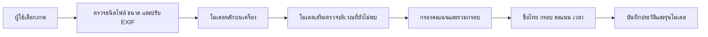

# รายงาน Mini Project: FreshLens ระบบระบุผักผลไม้บน localhost

อัปเดต 7 ตุลาคม 2026 · รุ่น produce-supplement-v4 · ไม่เทรนเพิ่มตามคำสั่งผู้ใช้

## 1. ที่มาและความสำคัญ

ระบบเดิมรู้จักชื่อที่จับคู่ได้42คลาส แต่ยังพลาดผักบางชนิดและวัตถุเล็กในภาพแน่น โมเดลที่มีชื่อคลาสอยู่ไม่ได้รับรองว่าจะตรวจได้ถูกทุกภาพ การเพิ่ม Dataset อย่างเดียวไม่ปรับความสามารถของโมเดลหากไม่มีการเทรน โครงการนี้ปรับใช้โมเดล pretrained เพิ่มและวัดผลจริงโดยไม่ปรับน้ำหนัก

## 2. แนวคิดและแนวทางการแก้ปัญหา

รักษาผลโมเดลหลัก แล้วใช้โมเดลเสริมค้นหาวัตถุที่ยังไม่พบ โดยรับเฉพาะคะแนนผ่านเกณฑ์และตำแหน่งที่ IoU กับกรอบก่อนหน้าไม่เกิน0.3 วิธีนี้เพิ่ม Recall แต่เสี่ยง false positives จึงเปรียบเทียบกับรุ่นเดิมบนภาพเดียวกันเสมอ ทดลองการแทนโมเดลตามคลาส การตัดภาพ และความละเอียดเพิ่มด้วย แต่เก็บผลที่ไม่ดีไว้ในรายงานและไม่ใช้เป็นค่าเริ่มต้น

## 3. วิธีการดำเนินงานและออกแบบ

### 3.1 กระบวนการ

1. แยก subagents ตรวจที่มาโมเดล จัดชุดข้อมูล และปรับหน้าเว็บ
2. ตรวจผลรายคลาสเดิม ดาวน์โหลด pretrained YOLO11m 35 labels และผู้สร้างเดิมv3; เก็บ revision/ขนาด/SHA256
3. ตรึง validation241ภาพ (237 annotated+4 controls),4047วัตถุ,47คลาส; ใช้เลือกวิธี/threshold
4. ทดลองหลายวิธี; trialแรกที่เลือกแทนรายคลาสมี F1 validationสูงขึ้น แต่ test134ภาพได้46.67% เทียบเดิม48.17% จึงปฏิเสธ ไม่อ้างว่าเป็นผลดี
5. เลือกแนวทางเสริมและ confidence .5/.5 จาก validationเท่านั้น; ใช้ confirmation validationใหม่120ภาพ,2522GT,39คลาส เลือกระหว่าง configurationsที่ตรึงแล้ว ไม่มีการปรับน้ำหนัก
6. ตรึงรุ่นที่เลือก แล้วประเมิน final testใหม่111ภาพ (107annotated+4controls),2409GT,33คลาส แบบpairedกับโมเดลเดิม ไม่มีการปรับ threshold/routing จากผล final testนี้
7. เปิดเว็บ อัปโหลดภาพจริง ตรวจ API/ภาพว่าง/ประวัติ/รายงาน และบันทึกหลักฐาน

### 3.2 Workflow

### 3.3 องค์ประกอบและเทคโนโลยี

เว็บภาษาไทย HTML/CSS/JavaScript; Python ThreadingHTTPServer bind127.0.0.1:8000; Ultralytics/PyTorch/Pillow; GPU RTX3050Ti Laptop4GB การ inference อยู่ในเครื่อง ไม่ส่งภาพไปบริการโมเดลภายนอก ระบบรับ JPG/PNG/WebPไม่เกิน12MB/25MP และเก็บประวัติเฉพาะผล ไม่เก็บภาพต้นฉบับ

produce_detector.py โหลด pretrained3checkpoints ใช้น้ำหนักเดิมทั้งหมด โมเดลหลักเกณฑ์.25; โมเดลเสริม.5; ชนิดเพิ่มเติมทดลอง.65; class-aware NMS IoU.45 และ suppress supplementary regionsเมื่อทับกรอบเดิม IoU>.3 ไม่มีการใช้ crop/960 ในรุ่นที่ส่งมอบเพราะผล validationไม่ดี

### 3.4 Dataset และขอบเขตชื่อ

Roboflow Combined Vegetables Fruits v8 / CC BY4.0 มี41985ภาพ:train34008/valid4619/test3358/47คลาส เก็บZIPและไฟล์แตกในdata ไม่ใช้trainเพื่อปรับน้ำหนัก รูปถูกstretch416×416; auditเดิมไม่เสร็จ จึงไม่อ้างว่าตรวจทั้ง41985ภาพแล้ว

จากเดิม42ชื่อ เพิ่มbeetและcabbageเป็น44ชื่อใน47คลาสเดิม ยังไม่รองรับbeans,egg,pattypan squash รวม9ชื่อใหม่จากโมเดลเสริมเป็น53ตัวเลือก: bitter gourd, bottle gourd, coconut, ginger, mango, melon, okra, pomegranate, turnip ชื่อใหม่9ชนิดเป็น**ทดลอง** ยังไม่มี annotationในDatasetนี้ จึงไม่มีคะแนนความแม่นยำรายชนิด และไม่จัดGreen_Orangeเป็นชนิดพืชใหม่

### 3.5 เทคนิค AI/ML

ใช้ CNN / Neural Network & Deep Learning เพื่อดึงคุณลักษณะภาพ; Classificationเพื่อชื่อชนิด; Bounding-box Regressionเพื่อตำแหน่ง; ensembleเพื่อเสริมวัตถุที่พลาด; evaluation/optimizationเพื่อเลือกthresholdจากvalidation ไม่ใช้Bayesian inference/RNN/RL/PCAหรือUnsupervised learningในรุ่นนี้ NLP/text promptingใช้ในYOLO-World/YOLOEรอบก่อนเท่านั้น Confidenceเป็นscoreไม่ใช่calibrated probability

## 4. ผลการดำเนินงานและการวิเคราะห์ผล

### 4.1 เปรียบเทียบ development validation241ภาพเดียวกัน

| วิธี | Precision | Recall | F1 |
|---|---:|---:|---:|
| โมเดลเดิม 640 | 46.16% | 33.61% | 38.90% |
| YOLO11m 35 labels | 30.39% | 3.48% | 6.25% |
| ผู้สร้างเดิม v3 | 42.58% | 31.83% | 36.43% |
| เดิม + crop tiles | 29.01% | 36.69% | 32.40% |
| เดิม 960 | 35.99% | 25.35% | 29.75% |
| เลือกโมเดลรายคลาส | 49.19% | 36.05% | 41.61% |
| เลือกโมเดล + threshold รายคลาส | 49.49% | 35.09% | 41.06% |
| เดิม + โมเดลเสริม confidence สูง | 43.24% | 36.03% | 39.30% |

โมเดล35labelsเสียเปรียบในการวัด47คลาสรวม แต่ผลยังบอกว่าแทนโมเดลเดิมทั้งหมดไม่ได้ การเลือกผลดีที่สุดรายคลาสเสี่ยงselection biasแม้ไม่มีtraining overfit Trial test134ภาพที่ไม่ดีถูกเก็บในexpansion_final_test.json

Confirmation validation120ภาพ: เดิมF162.30%, calibrated62.20%, supplement62.43%; supplementมีRecall57.22% เทียบเดิม55.43% คะแนนF1เพิ่มเพียงเล็กน้อย ไม่ควรกล่าวว่าดีขึ้นมาก

### 4.2 Final paired test111ภาพเดียวกัน

| ตัวชี้วัด | เดิม | รุ่นเสริม |
|---|---:|---:|
| TP | 925 | 963 |
| FP | 445 | 510 |
| FN | 1484 | 1446 |
| Precision | 67.52% | 65.38% |
| Recall | 38.40% | 39.98% |
| F1 | 48.95% | 49.61% |

ตรวจพบถูกเพิ่ม38วัตถุ พลาดลด38 แต่ตรวจผิดเพิ่ม65 จึงเพิ่มRecall1.58จุดเปอร์เซ็นต์และF10.66จุดเปอร์เซ็นต์ แลกกับPrecisionลด2.14จุดเปอร์เซ็นต์ สรุปว่าจับวัตถุเพิ่มขึ้นและF1ดีขึ้นเล็กน้อย **ยังไม่ยืนยันว่าแม่นขึ้นทุกชนิด**

Negative controls4ภาพ: เดิมตรวจผิด0 รุ่นเสริมตรวจผิด1ครั้ง จึงยังมีfalse positiveบนภาพไม่มีอาหาร รุ่นเสริมสำเร็จ111/111ภาพ; median inference116.3ms (ไม่รวมload model/HTTP/render;เครื่องอื่นต่างได้)

คะแนนตารางนี้เป็นผลโมเดลจากcoreconfigที่ตรึงก่อนfinal test เก็บไว้โดยไม่แก้ไข หลังทดสอบAPIพบโมเดลเสริมทายภาพสีขาวเป็นbroccoli จึงเพิ่มproduction input guardสำหรับภาพที่ช่วงค่าสีทุกchannelไม่เกิน2 ซึ่งไม่มีขอบวัตถุที่มองเห็น ไม่เปลี่ยนน้ำหนัก/threshold/routing ไม่หักFPย้อนหลังเพื่อแต่งคะแนน ทดสอบทั้งภาพสีพื้นและภาพมีวัตถุเล็กบนพื้นขาวแล้ว

จับคู่classตรงกัน + IoU≥.5 แบบone-to-one; ไม่ใช่mAP/accuracyของทุกภาพ FinalมีGT33คลาส ไม่มีGTสำหรับ: almond, asparagus, beet, blackberry, brussels sprouts, cabbage, egg, eggplant, green onion, kiwi, mandarin, pattypan squash, peach, watermelon ค่าไม่มีตัวหารต้องแสดงN/A ไม่สรุปเป็นความสำเร็จของคลาสนั้น ภาพsampleมีการเลือกตามคลาส ไม่ใช่random-populationestimate และห้ามเทียบคะแนนชุด103/134/111ต่างกันเป็นbefore/after

### 4.3 การป้องกันการใช้ข้อมูลซ้ำและการตรวจระบบ

Manifestเก็บภาพ/annotation hashes ตัดsource groupsที่ใช้ก่อนหน้าและแยกconfirmation/final test ประวัติของชุดที่ปฏิเสธเก็บไว้ source stemsชื่อทั่วไปทำให้ตัดภาพจำนวนมากจนขาดบางคลาส การใช้publicdataยังอาจทับpretraining และชื่อไฟล์ไม่พิสูจน์ความเป็นอิสระของฉาก controls4patternsเดิมไม่ใช่หลักฐานnegativeที่เป็นภาพธรรมชาติ

**จำนวนโมเดลที่เทรนในโครงการ0 / epochs0 / ภาพที่ใช้ปรับน้ำหนัก0** ไม่มีlearningcurveหรือหลักฐานลดoverfittingจากtraining การแยกข้อมูลลดtest-driven selection แต่validation optimizationยังมีselectionbias;ต้องใช้externalphotosที่annotatedจริงเพื่อยืนยัน หากต้องการแม่นขึ้นมากหรือรองรับผักไทยที่ไม่มีในlabels ต้องเก็บภาพหลายสภาพและfine-tuneในงานถัดไป

ตรวจระบบผ่าน12tests: API malformed400/crossorigin403/เกิน12MB413/schema/history/ภาพผลลัพธ์, boxsuppression, uniform-image guard, evaluationmath และauditfixture; หลักฐานรอบล่าสุดอยู่artifacts/api_checks.json และupgrade_browser_checks.json ผลรายภาพsupplement_final_test.json ผลรายคลาสper_class_results.csv

### 4.4 หลักฐานและการทำซ้ำ

เปิดเว็บใหม่ด้วยrun.ps1; ไม่รันtrain.py/experiment.ps1; requirements-lock.txtเก็บversions; frozen_selected_upgrade.jsonตรึงcoreก่อนfinal; frozen_production_upgrade.jsonเพิ่ม9ชื่อทดลองโดยไม่เปลี่ยนcorethresholds; upgrade_baseline_test.jsonเก็บpairedbaseline; selected_model_v1.jsonและreport_before_expansion.mdเก็บรุ่นก่อน

แหล่งข้อมูล: [Roboflow v8](https://universe.roboflow.com/yolo-jpkho/combined-vegetables-fruits/dataset/8), [ผู้สร้างโมเดล63คลาส](https://github.com/henningheyen/Fruits-And-Vegetables-Detection-Dataset), [Piyu12 YOLO11m](https://huggingface.co/Piyu12/fruit-veg-yolo11m-detector) รายละเอียดlicense/provenanceในdocs/model_expansion_sources.md ใช้คะแนนlocalจริง ไม่คัดลอกpublisherbenchmarkมาอ้างเป็นผลโครงการ

## สถานะ fine-tune รอบใหม่

ผู้ใช้อนุมัติให้ฝึกเพิ่มแล้ว แต่ fine-tune ยังไม่เริ่ม เพราะ audit และตรึง train/validation/final test ใหม่ยังไม่เสร็จ จึงยังไม่มี learning curve หรือคะแนนหลังฝึก รายงานสถานะและแผนการบันทึก epoch อยู่ที่ [training_report.md](training_report.md). ผล paired ก่อน fine-tune: 111 ภาพ, Precision 67.52%→65.38%, Recall 38.40%→39.98%, F1 48.95%→49.61% ระหว่างระบบเดิมกับระบบเสริม pretrained
