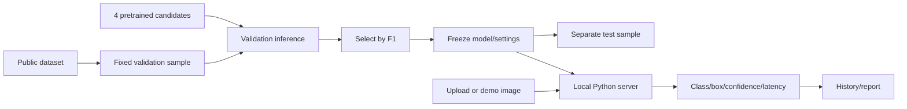

# รายงาน Mini Project: FreshLens ระบบระบุชนิดผักผลไม้ด้วยโมเดลสำเร็จรูป

วันที่จัดทำ: 7 ตุลาคม 2026 · สถานะ: ใช้งานและทดสอบบน localhost แล้ว · ไม่เทรนเพิ่มตามคำสั่งล่าสุด

## 1. ที่มาและความสำคัญ

การแยกชนิดผักผลไม้ด้วยสายตาใช้เวลาและสับสนได้เมื่อรูปร่างใกล้เคียง ภาพมีหลายชนิดหรือวัตถุบังกัน โครงการสร้างเว็บภาษาไทยให้ผู้ใช้เลือกภาพและดูชื่อชนิด กรอบตำแหน่ง คะแนนโมเดล และเวลาประมวลผล โดยเก็บหลักฐานการประเมินที่ตรวจสอบย้อนหลังได้ ระบบไม่ได้ตรวจความสดหรือความปลอดภัยอาหาร

## 2. แนวคิดและแนวทางการแก้ปัญหา

ใช้ pretrained object detector แทนการเทรนใหม่ เปรียบเทียบโมเดลบน validation เดียวกันก่อนเลือก แล้วตรึงโมเดลและค่าทำนายเพื่อประเมิน test แยกต่างหาก เว็บประมวลผลบนเครื่องด้วย GPU ภาพผู้ใช้อัปโหลดไม่ส่งไปบริการ inference ภายนอก

โมเดลที่เลือกคือ **YOLOv8m Fruits & Vegetables (author pretrained)** จับคู่ชื่อกับ Dataset ได้ **42 จาก 47 คลาส** ยังไม่รองรับ beans, beet, cabbage, egg, pattypan squash การมีชื่อในรายการไม่ได้รับรองว่าแม่นยำทุกภาพ

## 3. วิธีการดำเนินงานและออกแบบ

### 3.1 ขั้นตอนและกระบวนการ

1. ดาวน์โหลด Roboflow v8 แบบ YOLOv11 ลง data/dataset-v8-yolov11.zip แล้วแตกลง data/raw ตรวจ data.yaml และจำนวนภาพจาก ZIP จริง
2. พบ train 34,008 / validation 4,619 / test 3,358 ภาพ รวม 41,985 ภาพและ 47 คลาส; train ไม่ได้ใช้ปรับน้ำหนัก
3. หยุด pipeline เทรนและ audit เต็มชุดเดิมเมื่อผู้ใช้เปลี่ยนเป็นไม่เทรน การตรวจทุกไฟล์ยังไม่เสร็จ จึงไม่อ้างว่า audit ครบ Dataset ตัวอย่างที่ใช้ประเมินตรวจภาพ/annotation และเก็บ SHA256
4. หาและโหลด 4 pretrained candidates: YOLO-World small/medium, YOLOE small และ YOLOv8m ผักผลไม้ที่ผู้พัฒนาเทรนไว้แล้ว World/YOLOE ใช้ text embeddings เพื่อกำหนด vocabulary โดยไม่มี optimizer/training
5. ประเมิน validation 108 ภาพ (104 annotated + 4 synthetic negatives) เลือก 2 ภาพต่อคลาสและภาพหลายชนิดเพิ่ม ใช้ manifest/hash เดียวกันทุกโมเดล; confidence 0.25, NMS IoU 0.45, input 640
6. เลือกด้วย validation F1 จากการจับคู่ชื่อคลาสตรงกันและ IoU ≥ 0.50 แบบ one-to-one ตาม confidence บันทึก frozen_pretrained_model.json ก่อน final test
7. ประเมิน final test 103 ภาพ (99 annotated + 4 synthetic negatives) ครอบคลุม 47 คลาส เลี่ยง source stems ที่ตรง validation วิธีนี้อาจตัดเกินจริงเพราะชื่อทั่วไปชนกัน และยังไม่พิสูจน์ว่า scene/pretraining เป็นอิสระ
8. ทดสอบกดเว็บจริง การอัปโหลด ภาพว่าง bytes ไม่ใช่ภาพ origin ไม่อนุญาต และ payload เกินขนาด การประเมินไม่ปะปนในประวัติผู้ใช้

### 3.2 Workflow

### 3.3 ระบบและเครื่องมือ

HTML/CSS/JavaScript frontend; Python HTTP server ที่ 127.0.0.1:8000; Python 3.12; Ultralytics 8.4.174; PyTorch 2.7.1+cu128; RTX 3050 Ti Laptop GPU 4 GB; Pillow; YAML; requests; matplotlib และ CSV/JSON ทุก dependency และโมเดลอยู่ในโฟลเดอร์งาน หน้าเว็บแสดงชื่อไทย ภาพ กรอบ คะแนน ประวัติ ผลรายชนิด และรายงาน

### 3.4 เทคนิค AI/ML ที่ใช้จริง

| เทคนิค | การใช้และขอบเขต |
|---|---|
| Regression | หัว detector ทำนายพิกัด/ขนาด bounding box ไม่ได้ทำนายราคา น้ำหนัก หรือความสด |
| Classification | จำแนกคลาสของวัตถุจาก feature ของ detector |
| Neural Network / Deep Learning / CNN | ใช้ pretrained YOLO backbone/head ไม่ฝึก neural network ใหม่ |
| NLP | ใช้ CLIP/MobileCLIP text embeddings ในการทดลอง World/YOLOE; detector ที่เลือกใช้คลาสคงที่ |
| Evaluation & Optimization | เลือก 4 candidates ด้วย validation ก่อน test; ไม่ใช้ test ปรับ threshold |
| Bayesian inference | ไม่ใช้; confidence ไม่ใช่ Bayesian posterior ที่ผ่าน calibration |
| Unsupervised Learning / Dimensionality Reduction | ไม่ได้รัน K-means/PCA; analyze_features.py เป็นแผนเดิมที่ยังไม่รัน ไม่อ้างผล |
| RNN / RL | ไม่ใช้ เพราะเป็นภาพนิ่ง ไม่มี temporal sequence หรือ environment/action/reward |

สไลด์ที่ผู้ใช้แนบยังอ่านผ่านเครื่องมือไม่ได้ จึงไม่รับรองความสอดคล้องกับข้อกำหนดเฉพาะทุกหน้า

## 4. ผลการดำเนินงานและการวิเคราะห์ผล

### 4.1 เปรียบเทียบ validation เดียวกัน

| Candidate | ภาพ | Precision | Recall | F1 | คลาสที่มี TP |
|---|---:|---:|---:|---:|---:|
| YOLO-World v2 small + CLIP vocabulary | 108 | 21.16% | 2.69% | 4.77% | 10 |
| YOLO-World v2 medium + CLIP vocabulary | 108 | 40.43% | 4.00% | 7.28% | 16 |
| YOLOE 11 small + MobileCLIP vocabulary | 108 | 34.54% | 3.53% | 6.40% | 15 |
| YOLOv8m Fruits & Vegetables (author pretrained) | 108 | 49.68% | 32.60% | 39.36% | 35 |

โมเดลที่เลือกเพิ่ม validation F1 **34.60 percentage points** เทียบ World small เป็นผลการเลือกโมเดลสำเร็จรูป ไม่ใช่การดีขึ้นจากการเทรน กราฟอยู่ที่ artifacts/model_comparison.png

### 4.2 ผล final test

- สำเร็จ 103/103 ภาพ; API errors 0
- Ground-truth 2,027 วัตถุ; TP 729, FP 613, FN 1298
- Precision **54.32%**, Recall **35.96%**, F1 **43.28%**
- มี TP อย่างน้อย 1 วัตถุใน **39 คลาส** จาก 47 คลาส Dataset (รองรับ 42 ตาม mapping)
- Synthetic negatives 4 ภาพ ตรวจพบผิด 0 วัตถุ
- Mean inference latency 73.59 ms รวม warm-up ไม่รวม model load, decode, plot หรือ HTTP จึงไม่ใช่ end-to-end latency

ผลรายคลาสครบใน artifacts/per_class_results.csv และ pretrained_evaluation.json มี prediction/ground truth/IoU matches/image-label hash/latency ทุกภาพ ตัวเลขเป็น fixed-threshold precision/recall/F1 ไม่ใช่ mAP หรือเปอร์เซ็นต์ความถูกต้องของทุกภาพในชีวิตจริง รายละเอียดวิธีทดสอบเพิ่มใน docs/pretrained_validation.md

### 4.3 วิเคราะห์และข้อจำกัด

ระบบระบุชนิดและวาดกรอบจริงได้โดยไม่เทรน แต่ Recall ยังต่ำในภาพตลาด วัตถุเล็ก ภาพบังกัน และคลาสคล้ายกัน เป็นต้นแบบที่ตรวจข้อผิดพลาดย้อนหลังได้ ยังไม่รับรองความแม่นยำครบทุกชนิด ภาพสาธิตเลือกจากผลที่ตรวจจับถูกเพื่อสาธิต ไม่ใช่ตัวอย่างสุ่มหรือหลักฐานว่าแม่นทุกภาพ

โมเดลมี 63 labels จับคู่ synonyms ได้ 42 คลาส ตัด uppercase Strawberry/Tomato ที่ผู้พัฒนาระบุเป็น labels ผิดก่อนประเมิน; vegetable marrow จับคู่ zucchini/courgette มีความกำกวม ต้องอ่านผลรายคลาสประกอบ

Dataset สาธารณะอาจซ้ำกับ pretraining จึงยังไม่พิสูจน์ generalization ไปภาพถ่ายใหม่; ภาพถูก stretch 416×416 และ synthetic negatives ไม่แทนภาพธรรมชาติที่ไม่มีผักผลไม้ ควรเพิ่ม external annotated test, unknown handling และแยก scene/source ตาม provenance

### 4.4 Overfitting และทำซ้ำ

**โมเดลที่เทรนในโครงการ 0 ตัว / training epochs 0 / ภาพที่ใช้ปรับน้ำหนัก 0** ไม่มี learning curve หรือหลักฐานลด overfitting จาก fine-tuning การเลือกด้วย validation และเก็บ test แยกช่วยลดการปรับตาม test แต่ยังมี validation selection bias ไม่ใช้ผล test นี้ปรับต่อ Subset10/30/100 และ early stopping เป็นแผนเดิมที่หยุด ไม่ใช่ผลจริง

requirements-lock.txt เก็บ versions; frozen_pretrained_model.json เก็บ weights SHA256/settings; manifests เก็บ inputs/hashes; evaluator ไม่เทรนและปฏิเสธ run_id ที่เปลี่ยนกลางทดสอบ

## แหล่งอ้างอิง

- [Roboflow v8 / CC BY 4.0](https://universe.roboflow.com/yolo-jpkho/combined-vegetables-fruits/dataset/8)
- [ผู้พัฒนา pretrained Fruits-And-Vegetables Detector](https://github.com/henningheyen/Fruits-And-Vegetables-Detection-Dataset)
- [Original weights](https://drive.google.com/drive/folders/1I4mtQK11C3p41pO9raR0trgPVj0eQ2yb)
- [YOLO-World](https://docs.ultralytics.com/models/yolo-world), [YOLOE](https://docs.ultralytics.com/models/yoloe)
- รายละเอียดที่มาและ license: docs/model_sources.md; ไม่คัดลอก publisher benchmarks มาแทน local results
