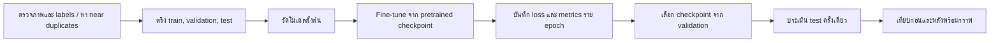

# รายงานสถานะการฝึกโมเดล FreshLens

วันที่ 7 ตุลาคม 2026 · รายงานฉบับสถานะปัจจุบัน

## สรุปสำหรับอาจารย์

โครงการมีระบบตรวจจับผักผลไม้บน localhost และมีผลวัดโมเดลเดิมก่อนเริ่ม fine-tune แล้ว ผู้ใช้ได้อนุมัติให้ฝึกต่อ แต่การ fine-tune รอบใหม่นี้ **ยังไม่เริ่ม** จึงยังไม่มีกราฟการเรียนรู้หรือคะแนนหลังเทรน รายงานนี้แยกผลที่วัดจริงออกจากงานเตรียมฝึกที่ยังค้าง โดยไม่สร้างค่า epoch ขึ้นมาแทนข้อมูลจริง

## 1. ที่มาและความสำคัญ

โมเดลก่อนหน้าไม่ตรวจจับผักทุกชนิดได้สม่ำเสมอ จึงต้องตรวจว่าการปรับน้ำหนักด้วยภาพติดป้ายกำกับจะช่วยได้หรือไม่ และผลดีขึ้นกับภาพที่ไม่ใช้ฝึกด้วยหรือไม่ กราฟ epoch มีความหมายเมื่อบันทึกค่าจากการฝึกจริง

## 2. แนวคิดและแนวทาง

ใช้โมเดลตรวจจับ pretrained เป็นจุดเริ่มต้น แล้ว fine-tune กับภาพ YOLO จาก Roboflow v8 เปรียบเทียบก่อนและหลังบน test manifest เดียวกัน และเลือก checkpoint จาก validation ก่อนเปิดผล test

ระบบปัจจุบันใช้โมเดล pretrained เดิมร่วมกับโมเดลเสริม น้ำหนักเหล่านั้นไม่ได้ผ่านการฝึกในโครงการนี้

## 3. วิธีดำเนินงานและออกแบบ

### 3.1 ข้อมูลและฮาร์ดแวร์

- Dataset: Combined Vegetables Fruits v8 จาก Roboflow มี 47 คลาส และ 41,985 ภาพตามข้อมูลชุดต้นทาง (train 34,008 / valid 4,619 / test 3,358), CC BY 4.0
- ZIP ต้นฉบับอยู่ `data/dataset-v8-yolov11.zip`; ชุดภาพที่แตกอยู่ `data/raw`
- GPU: NVIDIA GeForce RTX 3050 Ti Laptop GPU, VRAM ประมาณ 4 GB; PyTorch 2.7.1+cu128 และ CUDA ใช้งานได้
- การตรวจ audit เต็มรูปแบบและการตรึง split ใหม่ที่กันภาพซ้ำสำหรับ fine-tune ยังไม่เสร็จ จึงยังไม่เริ่มฝึก

### 3.2 Workflow

### 3.3 ผลที่ต้องบันทึกระหว่างฝึก

บันทึก `train/box_loss`, `train/cls_loss`, `train/dfl_loss`, `val/box_loss`, `val/cls_loss`, `val/dfl_loss`, Precision, Recall, mAP50 และ mAP50-95 ในแต่ละ epoch รวมถึงจำนวนภาพ, batch, image size, seed, optimizer, learning rate, weight decay และ hash ของข้อมูล/น้ำหนักตั้งต้น

ป้องกัน overfitting โดยแยก validation จาก train, ใช้ early stopping, และเลือก checkpoint จาก validation เท่านั้น หาก train loss ลดแต่ validation loss เพิ่มหรือ validation metric ลด จะรายงานสัญญาณนั้นตามจริง Test จะสงวนไว้สำหรับการประเมินรุ่นที่ตรึงแล้ว

## 4. ผลวัดที่มีอยู่ก่อน fine-tune

เปรียบเทียบระบบเดิมกับระบบเสริมบน test ชุดเดียวกัน 111 ภาพ มี ground truth 2,409 วัตถุ ครอบคลุม 33 จาก 47 คลาสในภาพตัวอย่างนี้ จับคู่คลาสตรงกันและ IoU ≥ 0.5

| ตัวชี้วัด | ระบบเดิม | ระบบเสริมปัจจุบัน |
|---|---:|---:|
| True positive | 925 | 963 |
| False positive | 445 | 510 |
| False negative | 1,484 | 1,446 |
| Precision | 67.52% | 65.38% |
| Recall | 38.40% | 39.98% |
| F1 | 48.95% | 49.61% |

ระบบเสริมตรวจพบถูกเพิ่ม 38 วัตถุและพลาดลด 38 แต่ false positive เพิ่ม 65 ค่า F1 เพิ่ม 0.66 จุดเปอร์เซ็นต์ ผลนี้มาจาก pretrained inference และการรวมโมเดล ยังไม่ใช่ผล fine-tune

### สถานะกราฟการเรียนรู้

| รายการ | สถานะ |
|---|---|
| โมเดลที่ fine-tune ในรอบนี้ | 0 |
| Epoch ที่จบ | 0 |
| Train/validation loss ตาม epoch | ยังไม่มีข้อมูล |
| Precision/Recall/mAP ตาม epoch | ยังไม่มีข้อมูล |
| คะแนนหลัง fine-tune | ยังไม่มีข้อมูล |

### งานที่ยังต้องทำก่อนเริ่มฝึก

1. ตรวจภาพและ annotations ตามขอบเขตที่เลือก พร้อมตรวจ hashes และข้อมูลรั่วไหลระหว่าง split
2. ตรึง manifest ใหม่และวัด checkpoint ตั้งต้นบน final test ที่กันจากข้อมูลเลือกโมเดล
3. ยืนยันการถ่ายโอนน้ำหนักจาก checkpoint 63 คลาสสู่ชื่อ 47 คลาสของ Dataset; คลาสบางคู่เป็นคำพ้องที่ต้อง map อย่างระมัดระวัง
4. Fine-tune บน GPU 4 GB โดยเลือก batch และขนาดภาพที่พอดีหน่วยความจำ บันทึกทุก epoch แล้วประเมินและเพิ่มผลจริง

จนกว่าจะทำขั้นตอนเหล่านี้ ไม่มีหลักฐานให้สรุปว่าโมเดลเรียนรู้เพิ่มหรือ overfit ลดลง รายงานและกราฟที่มีอยู่เป็นผลเปรียบเทียบ pretrained detector เท่านั้น

## หลักฐานประกอบ

- [รายงาน Mini Project และผลระบบล่าสุด](report.md)
- [ผลเปรียบเทียบ test แบบจับคู่](../artifacts/expansion_comparison.json)
- [กราฟเปรียบเทียบระบบเดิมกับระบบเสริม](../artifacts/upgrade_comparison.png)
- [ผล test รายภาพและรายคลาส](../artifacts/supplement_final_test.json)
- [บันทึกพัฒนาการ](worklog.md)
- [เว็บบน localhost](http://localhost:8000/)

อ้างอิงการตั้งค่าจาก [Ultralytics training documentation](https://docs.ultralytics.com/modes/train/) และ [Ultralytics metrics documentation](https://docs.ultralytics.com/guides/yolo-performance-metrics/)
